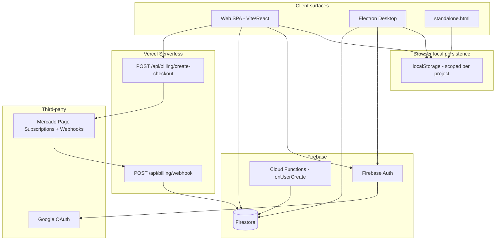
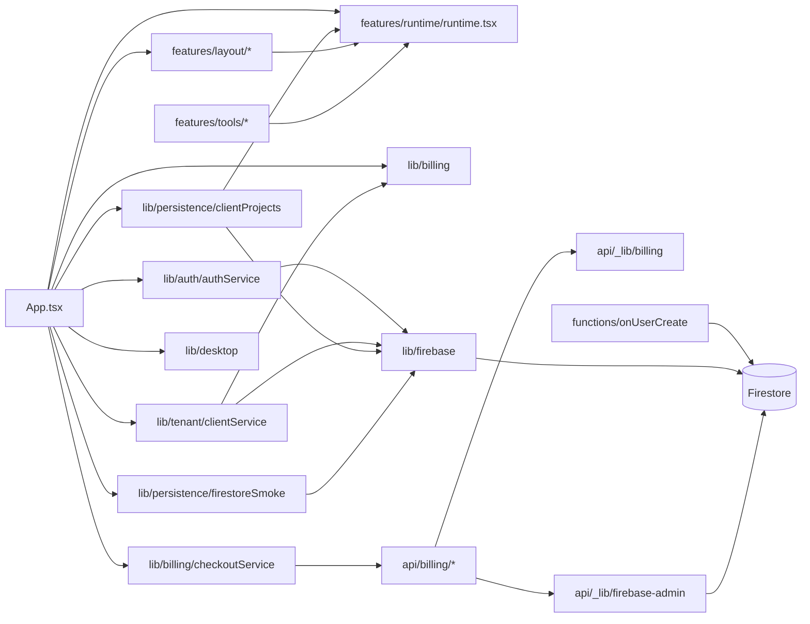

# Curv App — Project Status

**Audit date:** 2026-07-07  
**Auditor role:** Technical lead takeover  
**Repository:** `curv-app` v0.0.0

---

## Executive summary

Curv App is a **commercial/technical workspace for architecture firms** (CURVA). It supports proposals, deliverables, fee calculation, construction quoting, progress valuation, architectural briefs, and change orders — organized across three tracks: **Diseño**, **Construcción**, and **Seguimiento**.

The product ships as:

1. **Web SPA** (Vite + React)
2. **Desktop app** (Electron, Windows x64)
3. **Standalone HTML** (`standalone.html`, offline `file://` use)

Backend concerns are handled mostly by **Firebase** (Auth + Firestore) with **Mercado Pago billing** via a provider-agnostic layer and **Vercel serverless API routes**. There is no dedicated application server.

**Maturity estimate: early beta / late prototype (≈ 60–70%).**

Core domain tools are rich and usable locally. Multi-tenant cloud sync, billing, team roles, and production hardening are **partially implemented** with notable schema gaps, missing tests, and architectural debt centered on a ~4,000-line monolith (`runtime.tsx`).

### Production status update — 2026-07-07

- [x] GitHub -> Vercel deploy is live at `https://mu-arq.vercel.app/`.
- [x] Mercado Pago checkout links for BASE and PRO are working from production.
- [x] `POST /api/billing/create-checkout` returns Mercado Pago subscription checkout URLs for both plans.
- [x] `POST /api/billing/webhook` is reachable and accepts Mercado Pago's webhook simulator payload.
- [ ] Automatic payment-to-client association remains a follow-up because plan checkout URLs do not currently attach `clientId` / `external_reference`.

### Local implementation update - 2026-07-07

- [x] Started local-only implementation block; no GitHub push and no Vercel deploy.
- [x] `ProjectBaseMetadata` is reinforced as the canonical source for client, project, location, code, and currency.
- [x] Legacy keys such as `calc.cl`, `matrix.ub`, `brief.cod`, `oc.cod`, `cot.*`, `obra.*`, and `val.*` remain readable without deleting old localStorage data.
- [x] Firestore project hydration now brings `project + baseMeta` back to local `project.*` storage so Home and tools keep metadata aligned.
- [x] Cotizacion de Obra PDF import now attempts embedded PDF text first and only falls back to Tesseract OCR when needed.
- [x] OCR review now reports source, detected rows, incomplete rows, and blocks import of rows without a valid description.
- [x] Added local UX/marketing roadmap: `docs/UX_MARKETING_ROADMAP.md`.

### Local implementation update - 2026-07-08

- [x] Workspace sidebar now includes a compact editable base ficha for client, project, location, code, and currency using `ProjectBaseMetadata`.
- [x] Added local event tracking in `app.localEvents.v1` with a 250-event cap and a sidebar diagnostic panel for summary, recent events, JSON export, and cleanup.
- [x] Instrumented local events for base ficha edits, OCR start/completion/import/review, proposal export, and landing demo clicks.
- [x] Cotizacion de Obra imported PDF rows are marked with review metadata and can be filtered as pending OCR, highlighted, and marked reviewed.
- [x] Landing now includes three vertical demo cards: residential, commercial interiorism, and design-build.
- [x] This block remains local-only; no GitHub push and no Vercel deploy.

### Local aesthetic overhaul update - 2026-07-08

- [x] Introduced a Studio OS Premium visual layer with richer semantic tokens, refined cards, inputs, buttons, badges, metrics, shadows, and table/focus polish.
- [x] Rebuilt Landing around a clearer sales narrative: problem, connected workflow, vertical demos, product proof, BASE/PRO pricing, and sticky conversion CTA.
- [x] Reworked Home into a commercial dashboard with pipeline, operating metrics, quick project creation, recent project cards, and demo access.
- [x] Refined Workspace chrome with a wider premium sidebar, project status/proposal progress, contextual header, saved-state chips, and export click tracking.
- [x] Added local events for landing CTA clicks, Home project opens, Workspace export clicks, and tool first-step completion.
- [x] Verified Landing desktop/mobile without horizontal overflow; Home/Workspace compile and lint cleanly, but browser access remains gated by auth in a fresh session.

---

## Architecture

### High-level diagram

### Application layers

| Layer | Technology | Responsibility |
|-------|------------|----------------|
| UI shell | `App.tsx` | Auth routing, billing gate, project CRUD, PDF export, cloud hydration |
| Views | `src/features/layout/*` | Landing, auth, home dashboard, workspace chrome, onboarding |
| Domain + tools | `src/features/runtime/runtime.tsx` | All 9 tools, storage, calculations, print/PDF helpers, UI primitives |
| Services | `src/lib/*` | Firebase init, auth, tenant/client, billing, persistence, desktop bridge |
| API | `api/billing/*` | Mercado Pago checkout + webhook → Firestore billing updates |
| Functions | `functions/src/index.ts` | Auth trigger provisioning (legacy schema) |
| Desktop | `electron/*` | Static server, OAuth popups, external URL handling |

### Routing model (client-side)

No React Router. Route is persisted in localStorage as `app.route`:

- `landing` → marketing / entry
- `auth` → login/register
- `home` → project dashboard + paywall banner
- `workspace` → active project tools (gated by billing)

On every cold boot, the app **forces `landing` once** (`forceLandingOnBootRef` in `App.tsx`), even for authenticated users.

---

## Technology stack

| Concern | Choice |
|---------|--------|
| Frontend framework | **React 19** + **TypeScript 5.9** |
| Build tool | **Vite 8** (`base: "./"` for Electron/file compatibility) |
| Backend framework | **None** (Firebase BaaS + Vercel functions) |
| Database | **Cloud Firestore** (+ **localStorage** as primary tool datastore) |
| Authentication | **Firebase Auth** (email/password + Google popup) |
| State management | **React `useState` / `useEffect`** + custom **`usePersistentState`** (localStorage). No Redux/Zustand/Context store. |
| API structure | Vercel-style **`api/`** serverless handlers (not wired in-repo to `vite` dev proxy) |
| Desktop | **Electron 37** + **electron-builder** (NSIS + portable) |
| PDF/export | **html2canvas** + **jsPDF**; tool print via DOM portal |
| OCR/import | **tesseract.js** + **pdfjs-dist** (in-tool PDF import) |
| Payments | **Mercado Pago** subscriptions (preapproval + webhooks) via `BillingProvider` |
| Linting | ESLint 9 (flat config) |
| Tests | **None found** |

---

## Folder responsibilities

| Path | Responsibility |
|------|----------------|
| `src/` | Application source |
| `src/App.tsx` | Root orchestrator (~1,100 lines): auth, projects, sync, export, layout switching |
| `src/main.tsx` | React entry |
| `src/features/runtime/runtime.tsx` | **Monolith**: storage layer, all tools, business constants, UI primitives, metrics |
| `src/features/tools/` | Thin re-exports of tools from `runtime.tsx` |
| `src/features/layout/` | Page-level views (Landing, Auth, Home, Workspace shell, tour) |
| `src/features/ui/` | Mostly re-exports; `InfoBubble` is the only distinct UI module used |
| `src/lib/firebase.ts` | Firebase client init + env validation |
| `src/lib/auth/` | Auth wrappers (email, Google, logout, watch) |
| `src/lib/tenant/` | Multi-tenant client/user/membership Firestore operations |
| `src/lib/billing/` | Trial/paywall logic + checkout client |
| `src/lib/persistence/` | Firestore project CRUD + smoke test collection |
| `src/lib/desktop.ts` | Electron bridge helpers |
| `api/` | Vercel serverless Mercado Pago + Firebase Admin billing sync |
| `api/_lib/` | Shared Mercado Pago provider + Firebase Admin initialization |
| `functions/` | Firebase Cloud Functions (`onUserCreate` provisioning) |
| `electron/` | Main process, preload, local static server for OAuth |
| `scripts/` | Standalone HTML build, desktop dev/build, icon prep, signing guard |
| `docs/` | Firebase multitenant + billing ops notes |
| `dist/` | Production web build output |
| `standalone.html` | Single-file offline distribution artifact |
| `release/` | Electron distributables (when built) |
| `build/` | Desktop icon resources |
| `firestore.rules` | Tenant security rules |
| `firestore.indexes.json` | Collection group index for membership repair |
| `firebase.json` | Functions deploy config only (no hosting block in repo) |

---

## Dependency map (module interactions)

**Data flow (authenticated user):**

1. `watchAuth` → `ensureUserHasClient` → sets `activeClientId`
2. `importLocalProjectsOnce` migrates local projects → Firestore (once per client)
3. `listProjectsByClient` hydrates project list from cloud
4. Debounced `upsertProjectByClient` pushes project metadata + `baseMeta` + `ProjectRecord`
5. **Tool field data** (`calc.*`, `matrix.*`, etc.) stays in **localStorage only**

---

## Current implemented features

### Product / domain (9 tools)

| Tool ID | Name | Track |
|---------|------|-------|
| `calc` | Calculadora de Honorarios | Diseño |
| `matrix` | Matriz de Entregables | Diseño |
| `excl` | Exclusiones y Supuestos | Diseño |
| `cron` | Cronograma por Etapas | Diseño |
| `cot` | Cotización de Obra | Construcción |
| `cronobra` | Cronograma de Obra | Construcción |
| `brief` | Programa Arquitectónico | Construcción |
| `val` | Valorización de Avance | Seguimiento |
| `oc` | Orden de Cambio | Seguimiento |

### Platform

- [x] Multi-project workspace with per-project scoped localStorage
- [x] Legacy single-project → multi-project migration
- [x] Dark/light theme (CSS variables)
- [x] Onboarding tour
- [x] Per-tool print views + bundled PDF proposal export
- [x] Dashboard metrics / mini-gantt on home
- [x] Firebase Auth (email + Google)
- [x] Firestore multi-tenant model (`users`, `clients`, `members`, `projects`)
- [x] Trial paywall (14-day default) + plan limits defined (BASE/PRO)
- [x] Mercado Pago subscription checkout links (BASE/PRO) via `BillingProvider`
- [x] Mercado Pago webhook endpoint deployed and simulator-compatible
- [ ] Automatic Mercado Pago payment → `clientId` billing activation still needs a reliable association strategy
- [x] Desktop Electron build pipeline (unsigned local / signed CI intended)
- [x] Standalone HTML build
- [x] Firestore security rules (tenant-scoped)
- [x] PDF OCR import path (tesseract + pdfjs) inside tools

---

## Missing features

| Feature | Notes |
|---------|-------|
| Full cloud sync of tool state | Only project shell + `baseMeta` sync; calculator/matrix/etc. data is device-local |
| Team management UI | `listClientMembers`, role limits exist in code but no invite/manage screens |
| Role enforcement in UI | Firestore rules enforce roles; frontend does not read member role |
| EMPRESA plan | Marketed on landing as "PRONTO"; not in `ClientPlan` type |
| Firestore project delete | Local delete clears localStorage only; cloud doc remains |
| Client/tenant switcher UI | `setActiveClient` exists; no UI for multiple clients |
| Real-time sync / conflict resolution | One-shot hydrate + debounced upsert |
| Hosting / deploy config in repo | No `vercel.json`, no Firebase Hosting block |
| CI/CD workflow | README references `.github/workflows/release-desktop.yml` — **file missing** |
| Automated tests | No unit, integration, or e2e tests |
| i18n | Spanish hardcoded throughout |
| Offline-first cloud queue | Failed syncs only log to console |

---

## Known issues

### Critical / high

1. **Schema mismatch: Cloud Function vs client app** (`functions/src/index.ts`)
   - Function writes `ownerId`; rules and client expect `ownerUid`
   - Function writes member field `userId`; client queries `where("uid", "==", …)`
   - Function omits `id`, `plan`, `limits`, `billing` on client doc
   - Risk: duplicate/malformed tenants; membership repair queries miss function-created members

2. **Tool data not synced to Firestore**
   - Users lose workspace content when switching devices/browsers
   - Cloud hydration replaces project list but not scoped localStorage keys

3. **Checkout API has no authentication**
   - `POST /api/billing/create-checkout` accepts any `clientId`
   - Attacker could attach payments to arbitrary tenants (billing integrity risk)

4. **`smoke_persistence` collection blocked by security rules**
   - `readSmokeSnapshot` / `writeSmokeSnapshot` target a collection with **no rule match** → denied for clients

5. **Dual provisioning paths**
   - `onUserCreate` (admin SDK) and `ensureUserHasClient` (client SDK) both create tenants → race/duplicate risk

### Medium

6. **Forced landing on every app boot** — extra friction for returning users  
7. **`firebase-admin` in root `package.json` dependencies** — server library colocated with frontend; risk of bundling misconfiguration (currently only used under `api/`)  
8. **`node` listed as runtime dependency** in `package.json` — unusual and likely unintentional  
9. **Vite dev server does not serve `/api/*`** — local Mercado Pago checkout fails unless Vercel CLI or proxy is used  
10. **Project edit uses `window.prompt`** — brittle UX, no validation  
11. **Logout clears local `projects` state** but not necessarily all localStorage keys  
12. **No git-visible CI** despite README release checklist  

### Low

13. **`form-primitives.tsx`, `Brand.tsx`, `DocHeader.tsx`** — re-export shims; indirection without benefit  
14. **`.env.local` present in repo workspace** — ensure secrets are not committed (verify `.gitignore`)  
15. **Bugbot review** (2026-07-07): no branch diff available in this environment — no automated findings  

---

## Technical debt

| Area | Debt | Impact |
|------|------|--------|
| `runtime.tsx` (~4,173 lines) | God file: tools + storage + UI + constants | Hard to test, review, or parallelize |
| `App.tsx` (~1,131 lines) | God component orchestration | Same |
| Persistence model | Split localStorage/Firestore without contract | Data loss across devices |
| Type safety | Widespread `any` in tools | Runtime bugs |
| Styling | Inline styles everywhere | No design system reuse |
| Error handling | `console.warn` for sync failures | Silent degradation |
| Documentation vs code | README promises CI workflow that is absent | Release process gap |
| Cloud Function | Stale schema, overlaps client logic | Operational confusion |
| Membership model | Partially implemented | Can't ship team features without UI + fixes |

---

## Suggested roadmap

### Phase 0 — Stabilize foundation (1–2 weeks)

1. Align `functions/src/index.ts` with `clientService` schema (`ownerUid`, `uid`, `billing`, `plan`, `limits`, `id`)
2. Remove or gate duplicate provisioning (function **or** client bootstrap, not both)
3. Add Firestore rules for `smoke_persistence` or remove smoke code
4. Authenticate checkout API (Firebase ID token verification)
5. Add `vercel.json` + document local API dev workflow
6. Restore/create `.github/workflows/release-desktop.yml`
7. Remove `node` from frontend dependencies; move `firebase-admin` to devDependencies or a server-only package

### Phase 1 — Data integrity (2–3 weeks)

1. Define `ProjectSnapshot` schema: all scoped tool keys serialized into Firestore project doc (or subcollection)
2. Implement bidirectional sync with versioning / `updatedAt` conflict strategy
3. Firestore delete when project deleted locally
4. Persist `app.tools.*` and active tool per project to cloud

### Phase 2 — Product completeness (3–4 weeks)

1. Team management UI (invite, roles, plan limits enforcement)
2. Read member role in UI → viewer read-only mode
3. Client switcher for users in multiple tenants
4. Replace `window.prompt` with proper modals
5. Skip forced landing when session exists (remember last route)

### Phase 3 — Quality & scale (ongoing)

1. Split `runtime.tsx` into `storage/`, `tools/`, `domain/`, `ui/`
2. Add Vitest unit tests for billing, storage, calculations
3. Playwright e2e for auth + project + export happy path
4. Firebase Hosting or Vercel static deploy for web
5. EMPRESA plan or remove from marketing
6. Observability (Sentry, structured logging for webhooks)

---

## Recommended coding conventions

Follow existing patterns unless refactoring:

1. **TypeScript strict mode** — keep `strict: true`; avoid new `any`; prefer typed helpers in `lib/`
2. **Persistence** — use `usePersistentState` / `readStorage` / `writeStorage` with project scope; never raw `localStorage` in tools
3. **Firestore access** — only through `src/lib/*` service modules, never directly in views
4. **Env vars** — `VITE_*` for client; server secrets without prefix in `api/` only
5. **Components** — new UI in `features/`; do not add to `runtime.tsx` unless fixing a critical bug
6. **Styling** — match inline style + CSS variable theme (`--ui-*`) until a deliberate design pass
7. **Spanish copy** — keep user-facing strings in Spanish for consistency
8. **Minimal dependencies** — justify new packages; prefer browser/Firebase primitives
9. **No breaking changes** to localStorage key schema without migration flag (see `LEGACY_MIGRATION_FLAG_KEY` pattern)
10. **Commits** — small, feature-focused; do not commit `.env.local` or service account JSON

---

## Risks

| Risk | Likelihood | Severity | Mitigation |
|------|------------|----------|------------|
| User data loss on new device | High | High | Phase 1 full snapshot sync |
| Billing mis-association via open checkout API | Medium | High | Token auth on checkout |
| Monolith regression on any change | High | Medium | Split + tests |
| Electron OAuth breakage on Firebase/Google policy changes | Medium | Medium | Document authorized domains; test each release |
| Firestore rules/index drift | Medium | High | Deploy scripts in CI; integration tests against emulator |
| Mercado Pago webhook/client association drift | Medium | High | Staging webhook, idempotent handlers, and persistent checkout-session mapping |
| localStorage quota exceeded (large projects) | Low | Medium | Compress snapshots; cloud primary storage |

---

## Next development priorities

1. **Fix tenant provisioning schema** (Cloud Function ↔ clientService ↔ Firestore rules)  
2. **Implement full project snapshot sync** to Firestore (biggest user-visible gap)  
3. **Secure billing endpoints**  
4. **Add CI workflow** for desktop release + typecheck/lint  
5. **Begin `runtime.tsx` decomposition** — start with storage extraction  
6. **Add minimal test harness** (Vitest + Firebase emulator)  
7. **Defer new features** until data model and auth/billing are trustworthy  

---

## Environment variables

### Client (`.env` / `.env.local` — `VITE_` prefix)

| Variable | Purpose |
|----------|---------|
| `VITE_FIREBASE_API_KEY` | Firebase web API key |
| `VITE_FIREBASE_AUTH_DOMAIN` | Auth domain |
| `VITE_FIREBASE_PROJECT_ID` | Project ID |
| `VITE_FIREBASE_STORAGE_BUCKET` | Storage bucket |
| `VITE_FIREBASE_MESSAGING_SENDER_ID` | FCM sender ID |
| `VITE_FIREBASE_APP_ID` | Firebase app ID |
| `VITE_BILLING_PORTAL_URL` | External billing page (desktop opens in browser) |

Placeholder `xxx` disables Firebase smoke features.

### Server — Vercel `api/` (no `VITE_` prefix)

| Variable | Purpose |
|----------|---------|
| `BILLING_PROVIDER` | Billing provider id (`mercadopago`) |
| `MP_ACCESS_TOKEN` | Mercado Pago access token |
| `MP_WEBHOOK_SECRET` | Webhook signature secret |
| `MP_PREAPPROVAL_PLAN_BASE` | Preapproval plan id for BASE |
| `MP_PREAPPROVAL_PLAN_PRO` | Preapproval plan id for PRO |
| `FIREBASE_SERVICE_ACCOUNT_JSON` | Admin SDK credentials (JSON string) |
| `FIREBASE_SERVICE_ACCOUNT_B64` | Alternative base64-encoded service account |
| `APP_BASE_URL` | Fallback origin for checkout URLs |

### Desktop signing (optional)

| Variable | Purpose |
|----------|---------|
| `CSC_LINK` | Code signing certificate (PFX) |
| `CSC_KEY_PASSWORD` | Certificate password |
| `REQUIRE_SIGNING` | Fail build if signing env missing |

### Electron dev

| Variable | Purpose |
|----------|---------|
| `CURV_DESKTOP_DEV_SERVER_URL` | Override dev server URL |

---

## Third-party services

| Service | Usage |
|---------|-------|
| Firebase Auth | Email/password + Google sign-in |
| Cloud Firestore | Users, clients, members, projects, billing metadata |
| Firebase Cloud Functions | `onUserCreate` tenant bootstrap |
| Mercado Pago | Subscription checkout + webhook billing lifecycle |
| Google OAuth | Via Firebase Auth popup |
| Vercel (implied) | Hosts SPA + `api/` serverless routes |
| GitHub Releases (documented) | Desktop artifact distribution |
| html2canvas / jsPDF | Client-side PDF generation |
| tesseract.js / pdfjs-dist | PDF text extraction/import |
| Electron | Desktop shell |

---

## Deployment configuration (as documented in repo)

| Target | Mechanism | Status in repo |
|--------|-----------|----------------|
| Web build | `npm run build` -> `dist/` | Config present; verified 2026-07-07 |
| Web hosting | GitHub -> Vercel | Live at `https://mu-arq.vercel.app/` |
| API | `api/` Vercel functions | Live; checkout and webhook verified |
| Firestore rules | `firebase deploy --only firestore:rules` | Documented |
| Firestore indexes | `firebase deploy --only firestore:indexes` | Required for membership repair |
| Cloud Functions | `firebase deploy --only functions` | Config present |
| Desktop | `npm run desktop:dist` → `release/*.exe` | Config present |
| CI release | Tag `v*` → build + GitHub Release | **Workflow file missing** |

---

## Bugbot review note

Bugbot was requested on 2026-07-07 against branch changes. **No diff was available** in this workspace (likely no git history or clean tree). Re-run after meaningful commits on a feature branch.

---

*This document reflects repository state at audit time. No application code was modified during this audit.*
